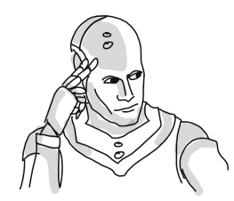
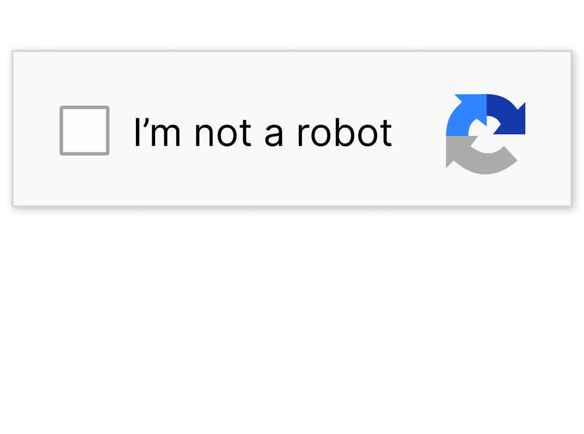

  
  
  
  📫 **email** | ssgyejin@gmail.com · 
  📝 **blog** | <a href="https://velog.io/@leeyejin1231">두꺼비는 두껍다</a>

---
### Work Experiences
>  **LG Electorinics** | R&D SW | Jan 2024 - May 2024    
>  **Crois** | AI Research Intern | Sep 2023 - Dec 2023

### Activities
> **3rd boostcamp AI Tech, NLP Track** | NAVER Connect Foundation | Jan 2022 - Jun 2022  
> **Industry-Academic Collaboration Projet** | Sungkyunkwan Univ, Shinhan Bank | May 2021 - Dec 2021  

### Awards
- **3rd K-AI Manufacturing Data Analysis Competition** (2023) | Ministry of SMEs and Startups, Smart Manufacturing Innovation Promotion Group, KAIST | Grand Prize  
- **3rd AI·ICT Creative & Free-topic Project Competition** (2023)| Sungkyunkwan Univ, Ministry of Science and ICT | Ranked 5th
- **Outstanding Open Source Software Student** (2022, 2023) | College of Software, Sungkyunkwan Univ | Encouragement Award  
- [2023 AI HACKATHON](https://github.com/sweet-muffin/skillink) | Udemy Curation, Wanted, JoCoding | 3rd Place  
- [2023 Spring Research Paper and Project Presentation](https://github.com/skku-skku/Record-summary-qa-system) | College of Software, Sungkyunkwan Univ | Best Presentation Award  
- [4th Undergraduate AI x BOOKATHON](https://github.com/JLake310/Bookathon_4th_Jagga) (2023) | Sungkyunkwan Univ, Industry-Academic-Research Innovation Council | Encouragement Award  
- [Jeju ICT Innovation Square Idea Competition](https://github.com/99ulling/99ulling) (2022) | Jeju Industry-University Cooperation Foundation | Encouragement Award  
- [1st 9oormthon](https://github.com/99ulling/99ulling) (2022) | kakao, goorm | Grand Prize

### Publications
[AmpleHate: Amplify target-context relationships for implicit hate speech detection](https://github.com/leeyejin1231/AmpleHate) | **Y Lee**, J Hahn, H Ahn, YS Han | EMNLP 2025  
[RV-HATE: Reinforced Multi-Module Voting for Implicit Hate Speech Detection](https://github.com/leeyejin1231/RV-HATE) | **Y Lee**, H Ahn, YS Han | Underreview  
[KOTOX: A Korean Toxic Text for Obfuscation and Detoxification](https://github.com/leeyejin1231/KOTOX) | **Y Lee**, SH Kim, H Jin, D Kim, Y Kim, YS Han | Underreview  

### Patent
[THE CARING SEAT IN A PUBLIC TRANSPORTATION](https://github.com/leeyejin1231/JKJproject) | 10-2020-0000289
